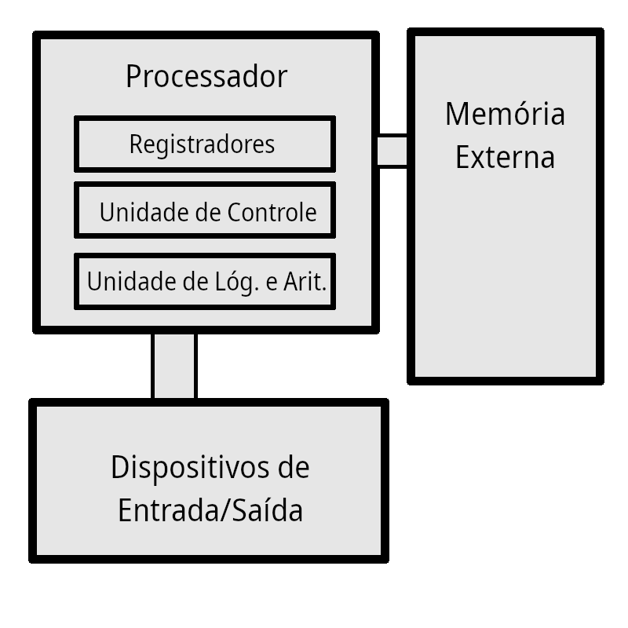

# Caches

## Introdução

A memória é um componente importante nos computadores. Ela é uma parte fundamental da arquitetura de von Neumann, uma arquitetura que é base de muitos computadores até hoje. Nessa arquitetura, a função da memória é armazenar instruções que podem ser decodificadas e lidas pela Unidade de Controle e também armazenar dados, como resultados de operações de soma e subtração da Unidade Lógica de Controle (ULA).

*Diagrama da Arquitetura de von Neumann*

O computador possui vários tipos de armazenar dados em memória. Dentre elas, estão:
- **Registradores**: São unidades de memória dentro do próprio processador. São neles que são feitas as operações da ULA do computador, e também são as memórias de mais rápido acesso. Geralmente, o processador os possui em pequena quantidade.
- **RAM (Random Access Memory)**: É uma memória externa ao processador que permite acesso aleatório de dados. Ela é mais lenta que os registradores. Ela pode armazenar bem mais dados do que registradores.
- **Memória em Disco**: É um tipo de memória que permite guardar dados de forma permanente, ou seja, mesmo que o computador seja desligado os seus dados não serão apagados. Ela é a memória mais lenta de acessar. Exemplos são discos rígidos.

Na prática, códigos e programas são armazenados em memória em disco. Quando precisam ser utilizados, são carregados na RAM. O processador lê as instruções armazenadas na RAM, carrega os valores necessários para os registradores, realiza operações com eles e guarda-os na RAM caso necessário.

Porém, com o desenvolvimento computacional, notou-se que a RAM tornou-se um empecilho para a velocidade do processamento. Isso porque a velocidade que o processador é capaz de processar os dados é muito mais rápido do que a velocidade da leitura da RAM. Para resolver esse problema, foi necessário criar uma memória, assim como a RAM, que o processador realizasse o acesso mais rapidamente, onde pudesse guardar dados que fossem utilizados de maneira recorrente.

## Memória Cache

### O que é ?

A memória cache foi feita como uma solução para esses problemas citados anteriormente. Ela é uma memória que fica entre o processador e a RAM, em que são guardados dados que são utilizados de maneira recorrente.

### Características

Uma das características principais da cache é que sua organização interna é feita diferente da organização interna da RAM. Enquanto a RAM organiza os dados por indexação, a cache organiza os dados pelo seu conteúdo.

O que isso quer dizer é que a cache segue dois princípios quando organiza seus dados: o princípio da localidade temporal e localidade espacial. O princípio da localidade temporal quer dizer que se um dado foi utilizado recentemente, ele provavelmente será utilizado novamente. O princípio da temporalidade espacial consiste em que se um dado foi utilizado, as posições pertos desse dado também podem ser utilizadas futuramente. Um exemplo disso é uma estrutura que usa mais memória que uma palavra, ou uma lista contígua de dados.

## Tamanho da Cache

O tamanho da cache é definido a partir de um trade-off. Quanto maior o tamanho da cache, mais portas lógicas ela terá que usar para indexar a memória, tendo um maior tempo de propagação e, por fim, sendo mais lenta o seu acesso. Por outro lado, uma função de mapeamento tem uma taxa de acerto mais alta.

Enquanto isso, uma cache com menor tamanho é mais rápida no endereçamento e no seu acesso, já que é utilizado menos portas lógicas e possui menor tempo de propagação. Mas, dependendo da função de mapeamento, ela pode ter uma taxa de acerto mais baixa.

## Tamanho do bloco

Blocos são conjuntos de palavra que a cache guarda. Por exemplo, a cache pode guardar 4 palavras de 32 bits em cada bloco, ou pode guardar apenas 1 palavra. Tudo isso depende da funcionalidade da cache.

Nesse caso, quanto maior o bloco, maior a taxa de acerto da função de mapeamento. Entretanto, nem sempre é bom ter um bloco grande, pois pode ser haja maior necessidade de utilizar dados que foram substituídos, e não dados buscados recentemente.

## Estrutura da Cache

Para organizar a memória da cache internamente, é necessário que haja alguns bits de controle e de identificação. Esses bits podem ser classificados da seguinte forma:

- **Tag**: Possui o papel de identificar aquela linha.
- **Validade**: Bit de validade. Serve para indicar se naquela linha há um dado válido.
- **Modificação**: Bit de modificação. Tem o papel de indicar se aquele dado foi modificado ou não.
- **Bits de Substituição**: São bits utilizados por algoritmos de substituição. Por exemplo, se for implementado uma fila de dados, é necessário alguns bits para identificar quando aquele elemento foi inserido.
- **Bits de Dados**: São os bits que contém as palavras do bloco.

## Funções de mapeamento

Como o número de blocos na memória cache é sempre menor que o na memória principal, é necessário utilizar algoritimos que mapeiam os blocos da memória principal e atribuem eles aos blocos da memória cache, esses algoritimos são as funções de mapeamento, com as principais sendo:

  
### Mapeamento Direto

No mapeamento direto, cada bloco na memória principal é mapeado em apenas uma linha da cache, segundo a equação `i = j mod(m)`, onde `i` é o númeoro da linha na cache, `j` é o número do bloco da memória principal e `m` o número de linhas total da cache.

**############################# COLOCAR IMAGEM AQUI #############################**

Já que vários blocos da memória principal podem ser mapeados na mesma linha da memória cache, para saber se o bloco que se quer acessar é o que já está na cache, um campo chamado de tag (ou rótulo) deve ser usado para identificar cada bloco.

Nesse método, o endereço de cada bloco na cache deve ser dividido em 4 campos:
- **Byte offset**: Para arquiteturas endereçadas a byte
- **Word offset**: Para quando um bloco possui mais de uma palavra
- **Index**: Resultado da operação de módulo (`i`)
- **Tag**: Resto do endereço (Identificação do bloco)

Além disso, para saber se a entrada da cache possui um endereço válido ou não temos que usar um bit de validade, geralmente marcado por `V`.

**############################# COLOCAR IMAGEM AQUI #############################**

#### Vantagens

- É a técnica mais simples
- Possui baixo custo de implementação

#### Desvantagem

- Cada bloco só pode ser mapeado para uma posição fixa da cache, logo, se forem acessados a dois blocos distintos mapeados na mesma linha eles serão continuamente trocados na cache, o que leva a uma baixa taxa de acertos. 

### Mapeamento Associativo

O mapeamento associativo evita a desvantagem do mapeamento direto, pois um bloco da memória principal pode ser carregado em qualquer linha da cache.

Nesse método, diferentemente do anterior, o endereço é dividido em somente 3 campos:
- **Byte offset**: Para arquiteturas endereçadas a byte
- **Word offset**: Para quando um bloco possui mais de uma palavra
- **Tag**: Resto do endereço (Identificação do bloco)

Para determinar se um bloco está na cache ou não, a lógica de controle de memória cache compara a tag do endereço do bloco com as tags de todos os blocos da cache.

**############################# COLOCAR IMAGEM AQUI #############################**

#### Vantagem:

- Maior flexibilidade para escplher a linha a ser substituída quando um novo bloco é trazido para a cache.

#### Desvantagem:

- Maior complexidade do circuito necessários para a comparação das tags de todos os blocos da cache em paralelo.

### Mapeamento Associativo por Conjunto
Esse tipo de mapeamento combina as vantagens do mapeamento direto e do mapeamento associativo, assim minimizando as desvantagens. Esse modelo divide a memória cache em `v` conjuntos de `k` linhas.

Assim como no mapeamento direto, nesse método o endereço é dividido em 4 campos (diferentes do mapeamento direto):
- **Byte offset**: Para arquiteturas endereçadas a byte
- **Word offset**: Para quando um bloco possui mais de uma palavra
- **Set**: Para a identificação do conjunto
- **Tag**: Resto do endereço (Identificação do bloco)

**############################# COLOCAR IMAGEM AQUI #############################**

**############################# COLOCAR IMAGEM AQUI #############################**

**############################# COLOCAR IMAGEM AQUI #############################**

O endereço da memória cache é interpretado como a junção dos campos: `rótulo + conjunto + palavra`.

Existem dois tipos de mapeamento associativo por conjuntos, que são:
- **Mapeamento totalmente associativo**: Tag muito grande e é comparada com a tag de cada bloco de memória cache
- **Mapeamento associativo por conjunto de k linhas**: Tag bem menor e só é comparada com k tags do mesmo set

**############################# COLOCAR IMAGEM AQUI #############################**

**############################# COLOCAR IMAGEM AQUI #############################**

